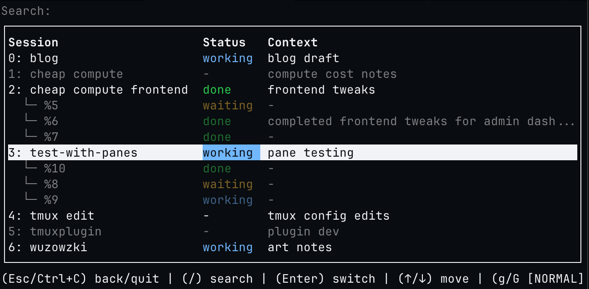

<h1 align="center">jkl</h1>

<p align="center"><strong>Inspect your agent statuses in tmux sessions.</strong></p>

<p align="center">
  
</p>

<p align="center">The better agent list view</p>

## Requirements

- `tmux`
- `fzf`

## Install

### Binary (recommended)

```
curl -fsSL https://raw.githubusercontent.com/cruzluna/jkl-2/master/install.sh | bash
```

Optional: set `JKL_INSTALL_DIR` to choose where binaries/scripts are installed.
On Linux, the installer picks:

- `*-unknown-linux-musl` on Alpine
- `x86_64-unknown-linux-gnu-al2` on Amazon Linux 2
- `*-unknown-linux-gnu` otherwise

The installer adds:

- `jkl`
- `jkl-sync-fig-autocomplete` (if you answer `y` to the install prompt)

To force this in non-interactive installs, set:

- `JKL_INSTALL_FIG_COMPLETIONS=1` to install
- `JKL_INSTALL_FIG_COMPLETIONS=0` to skip

### Release Asset (manual)

Use install overrides instead of downloading/extracting assets manually.

```bash
# specific release tag:
JKL_INSTALL_TAG=v0.2.0 curl -fsSL https://raw.githubusercontent.com/cruzluna/jkl-2/master/install.sh | bash

# specific target (example: musl):
JKL_INSTALL_TARGET=x86_64-unknown-linux-musl curl -fsSL https://raw.githubusercontent.com/cruzluna/jkl-2/master/install.sh | bash

# both:
JKL_INSTALL_TAG=v0.2.0-rc.1 JKL_INSTALL_TARGET=aarch64-unknown-linux-gnu curl -fsSL https://raw.githubusercontent.com/cruzluna/jkl-2/master/install.sh | bash
```

Optional override:

- `JKL_INSTALL_ASSET_SUFFIX=-al2` to force an asset suffix (normally auto-detected on Amazon Linux 2)

### Cargo

```
cargo install --git https://github.com/cruzluna/jkl-2
```

If needed, ensure `~/.cargo/bin` is on your `PATH`.

## Update

```
jkl update
jkl-sync-fig-autocomplete
```

To include pre-releases:

```
jkl update --pre-release
jkl-sync-fig-autocomplete
```

To include dev preview builds from the `dev` branch:

```
jkl update --pre-release --dev
jkl-sync-fig-autocomplete
```

Master pre-releases are selected from tags that include `-rc.` (for example, `v0.2.0-rc.1`).
Dev previews are selected from tags that include `-dev.` (for example, `v0.2.0-dev.42.abc1234`).
`jkl update` keeps the installed binary target (for example, a `*-unknown-linux-musl` install updates to `*-unknown-linux-musl` assets). On Amazon Linux 2, `jkl update` automatically selects `-al2` release assets.

If you installed via Cargo:

```
cargo install --git https://github.com/cruzluna/jkl-2 --force
```

Then refresh Fig autocomplete:

```
curl -fsSL https://raw.githubusercontent.com/cruzluna/jkl-2/master/scripts/sync-fig-autocomplete.sh | bash
```

## Uninstall

Uninstall the `jkl` binary from its current install location:

```
jkl uninstall
```

Also remove local metadata/logs in `~/.config/jkl`:

```
jkl uninstall --purge-data
```

### Release assets

The update command and install script expect GitHub release assets named:

- `jkl-x86_64-apple-darwin.tar.gz`
- `jkl-aarch64-apple-darwin.tar.gz`
- `jkl-x86_64-unknown-linux-gnu.tar.gz`
- `jkl-x86_64-unknown-linux-gnu-al2.tar.gz`
- `jkl-aarch64-unknown-linux-gnu.tar.gz`
- `jkl-x86_64-unknown-linux-musl.tar.gz`
- `jkl-aarch64-unknown-linux-musl.tar.gz`

Each archive should contain the `jkl` binary at the top level.

## Usage

- Launch the TUI: `jkl tui`
- Quit the TUI: `q`, `Esc`, or `Ctrl+C` (Ctrl+C exits search first)
- Navigate rows: `↑`/`↓` or `j`/`k`
- Expand/collapse session details (windows + panes): `l`/`h`
- Delete selected session/window/pane: `x`, then `x` to confirm (any other key cancels)
- Refresh pane list: `r`
- Search sessions: `/` (type to filter, `Esc` to exit search)
- Switch to session: `Enter`
- Upsert session metadata: `jkl upsert <session_name...> [--session-id <session_id>] [--status <status>] [--context <text...>]`
- Upsert pane metadata: `jkl upsert <session_name...> --pane-id <pane_id> [--window-id <window_id> [--window-name <window_name>]] [--status <status>] [--context <text...>]`
- Rename session entry: `jkl rename <session_id> <session_name...>`
- Sync persisted metadata with live tmux state: `jkl sync`
- Update from stable channel: `jkl update`
- Update from master pre-release channel: `jkl update --pre-release`
- Update from dev preview channel: `jkl update --pre-release --dev`
- Uninstall binary from current location: `jkl uninstall [--purge-data]`
- Pane status selector: `jkl tui --pane-state --session-name <session_name...> --pane-id <pane_id>`

Multi-word session names or context can be passed without quotes; use `--` to terminate positional values if needed.

## Tmux Plugin (TPM)

Add the plugin and reload TPM:

```
set -g @plugin 'cruzluna/jkl-2'

# Initialize TMUX plugin manager (keep at bottom)
run '~/.tmux/plugins/tpm/tpm'
```

If tpm fails to download plugin: 
``` bash
$ tmux run-shell "~/.tmux/plugins/tpm/bin/install_plugins"
```

Default prefix bindings (only set when the key is currently unbound):

- `f`: open `jkl tui` in a popup
- `W`: prompt for context and run `jkl upsert '#S' --session-id '#{session_id}' --context <input>`
- `e`: open `~/.config/jkl/session_context.json` in `nvim`
- `S`: open pane status selector popup

Some keys may already be used by tmux defaults (for example `prefix + f` runs `find-window`). If a key conflicts, use one of these:

```tmux
# 1) Unbind manually before the plugin is loaded
unbind-key -T prefix f

# 2) Let jkl unbind only the conflicting key before binding
set -g @jkl_unbind_key_tui 'on'

# 3) Use a different key
set -g @jkl_key_tui 'J'
```

You can configure or disable each binding:

```tmux
# Set custom keys
set -g @jkl_key_tui 'J'
set -g @jkl_key_context 'C'
set -g @jkl_key_edit 'E'
set -g @jkl_key_pane_state 'P'

# Disable a binding
set -g @jkl_key_edit 'none'
```

Per-key unbind options:
`@jkl_unbind_key_tui`, `@jkl_unbind_key_context`, `@jkl_unbind_key_edit`, `@jkl_unbind_key_pane_state`.

By default the plugin does not override existing tmux/user bindings. If you want it to force overrides without unbinding first, set:

```tmux
set -g @jkl_force_bind_keys 'on'
```

## Integrations

### Claude Code hooks

Claude Code hooks can be configured in `~/.claude/settings.json` (user), `.claude/settings.json` (project), or `.claude/settings.local.json` (local project). The example below marks the current tmux pane as `working` when you submit a prompt, and `waiting` when Claude stops.

```json
{
  "hooks": {
    "UserPromptSubmit": [
      {
        "hooks": [
          {
            "type": "command",
            "command": "[ -n \"$TMUX\" ] || exit 0; jkl upsert \"$(tmux display-message -p '#S')\" --session-id \"$(tmux display-message -p '#{session_id}')\" --pane-id \"$(tmux display-message -p '#{pane_id}')\" --status working"
          }
        ]
      }
    ],
    "Stop": [
      {
        "hooks": [
          {
            "type": "command",
            "command": "[ -n \"$TMUX\" ] || exit 0; jkl upsert \"$(tmux display-message -p '#S')\" --session-id \"$(tmux display-message -p '#{session_id}')\" --pane-id \"$(tmux display-message -p '#{pane_id}')\" --status waiting"
          }
        ]
      }
    ]
  }
}
```

Docs:

- https://code.claude.com/docs/en/hooks-guide
- https://code.claude.com/docs/en/hooks

### Kiro CLI hooks

Kiro CLI hooks are defined in an agent config file (for example `.kiro/agents/jkl.json` in a project, or `~/.kiro/agents/jkl.json` globally). The same pattern can be applied with `userPromptSubmit` and `stop` hooks:

```json
{
  "name": "jkl",
  "description": "Sync jkl status with Kiro activity",
  "hooks": {
    "userPromptSubmit": [
      {
        "command": "[ -n \"$TMUX\" ] || exit 0; jkl upsert \"$(tmux display-message -p '#S')\" --session-id \"$(tmux display-message -p '#{session_id}')\" --pane-id \"$(tmux display-message -p '#{pane_id}')\" --status working"
      }
    ],
    "stop": [
      {
        "command": "[ -n \"$TMUX\" ] || exit 0; jkl upsert \"$(tmux display-message -p '#S')\" --session-id \"$(tmux display-message -p '#{session_id}')\" --pane-id \"$(tmux display-message -p '#{pane_id}')\" --status waiting"
      }
    ]
  }
}
```

Kiro also supports `preToolUse` and `postToolUse` hooks with tool `matcher` patterns (for example `execute_bash` or `fs_write`) if you want finer-grained automation.

Docs:

- https://kiro.dev/docs/cli/hooks/
- https://kiro.dev/docs/cli/custom-agents/configuration-reference/

### Cursor CLI hooks

Cursor hooks are configured in `hooks.json` at either the user level (`~/.cursor/hooks.json`) or the project level (`<project>/.cursor/hooks.json`).

The example below uses Agent hooks to mirror the Kiro behavior: set the current tmux pane to `working` on `beforeSubmitPrompt`, then back to `waiting` on `stop`.

```json
{
  "version": 1,
  "hooks": {
    "beforeSubmitPrompt": [
      {
        "command": "[ -n \"$TMUX\" ] || exit 0; jkl upsert \"$(tmux display-message -p '#S')\" --session-id \"$(tmux display-message -p '#{session_id}')\" --pane-id \"$(tmux display-message -p '#{pane_id}')\" --status working"
      }
    ],
    "stop": [
      {
        "command": "[ -n \"$TMUX\" ] || exit 0; jkl upsert \"$(tmux display-message -p '#S')\" --session-id \"$(tmux display-message -p '#{session_id}')\" --pane-id \"$(tmux display-message -p '#{pane_id}')\" --status waiting"
      }
    ]
  }
}
```

If you prefer scripts instead of inline commands, note the path difference from Cursor docs: user hooks run from `~/.cursor/` (for example `./hooks/script.sh`), while project hooks run from the project root (for example `.cursor/hooks/script.sh`).

Docs:

- https://cursor.com/docs/agent/hooks

### Fig autocomplete

A standalone Fig spec for `jkl` lives at:

- `completions/fig/jkl.ts`

User sync script:

- `scripts/sync-fig-autocomplete.sh`

Installed binary helper (from `install.sh`):

- `jkl-sync-fig-autocomplete`

Run either:

```
jkl-sync-fig-autocomplete
```

or:

```
curl -fsSL https://raw.githubusercontent.com/cruzluna/jkl-2/master/scripts/sync-fig-autocomplete.sh | bash
```

## Session Context

The TUI reads optional metadata from `~/.config/jkl/session_context.json`. If the file does not exist, it is created with `{}` the first time you run the TUI.

Shape (keyed by `blake3(session_name)`):

```json
{
  "2f0d7b3b5e3b9b1d4b4b5b8b8e2e2e9a2d2d4d5f2f0f5e5f2d9b3f1a5c8e": {
    "session_name": "work",
    "session_status": "waiting",
    "session_context": "my project",
    "windows": {
      "@10": {
        "window_id": "@10",
        "window_name": "editor"
      }
    },
    "panes": {
      "%1": {
        "window_id": "@10",
        "window_name": "editor",
        "pane_status": "working",
        "pane_context": "focus time"
      }
    }
  }
}
```

Upsert examples:

```
jkl upsert "work" --status working --context "my project"
jkl upsert "work" --pane-id %1 --status working --context "focus time"
```

Cleanup/repair example:

```
jkl sync
```

`jkl sync` keeps only sessions/windows/panes that still exist in tmux. Session matching is ID-first; if no ID match is found it falls back to session name. When a session is matched by ID but the name changed, jkl updates `session_name` and re-keys the JSON entry to `blake3(new_session_name)`.

Status values:

- `working` (blue)
- `waiting` or `idle` (yellow)
- `done` (green)
- missing values render as `-`

## Testing

- `cargo check`
- `cargo test`

## Development

- Run TUI locally: `cargo run -- tui`
- Point tmux at a test server: `tmux -L test list-sessions`
- Use a temp context file: `HOME=/tmp/jkl-dev cargo run -- tui`

## Agent Instructions

Use this tool to update session and pane statuses; update pane context when needed. Do not modify session context unless explicitly requested. The tool runs inside tmux, so always include tmux context (session name and pane ID) when updating metadata. Use `jkl --help` to review available commands.

`jkl upsert` details:

```
Usage: jkl upsert [OPTIONS] [SESSION_NAME]...

Arguments:
  [SESSION_NAME]...

Options:
      --session-id <SESSION_ID>
      --pane-id <PANE_ID>
      --window-id <WINDOW_ID>
      --window-name <WINDOW_NAME>
      --status <STATUS>
      --context <CONTEXT>...
```

`--window-name` requires `--window-id`.

Examples:

- `jkl upsert <session_name...> [--session-id <session_id>] [--status <status>] [--context <text...>]` upserts session metadata.
- `jkl upsert <session_name...> --pane-id <pane_id> [--window-id <window_id> [--window-name <window_name>]] [--status <status>] [--context <text...>]` upserts pane metadata.
- `jkl sync` removes stale session/pane metadata and migrates renamed sessions using tmux `session_id`.

Sample commands:

```
# Update session status
jkl upsert "work" --status working

# Update pane status
jkl upsert "work" --pane-id %1 --status waiting

# Update pane context
jkl upsert "work" --pane-id %1 --context "debugging timeout"
```
